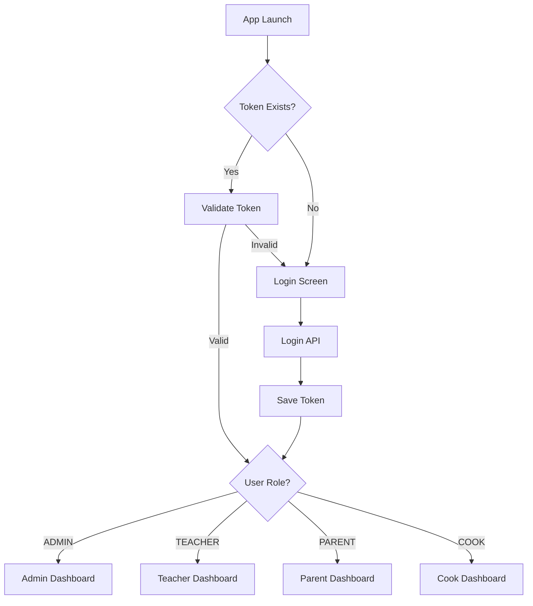

# 📱 School LMS - Mobile App Architecture

## 🎯 OVERVIEW

Cross-platform mobile app for School LMS with role-based access for:
- **SUPER_ADMIN** - System owner
- **ADMIN** - School administrator  
- **TEACHER** - Teachers
- **PARENT** - Parents/Guardians
- **COOK** - Kitchen staff (Staff role)

---

## 🏗️ TECH STACK

### Frontend Framework
- **React Native** (Expo) - Cross-platform (iOS + Android)
- **TypeScript** - Type safety
- **React Navigation** - Navigation
- **Zustand** - State management
- **TanStack Query** - Data fetching & caching
- **React Hook Form** - Form management
- **Zod** - Validation

### UI Components
- **NativeWind** (Tailwind for React Native)
- **React Native Paper** - Material Design components
- **React Native Reanimated** - Animations
- **React Native Gesture Handler** - Gestures

### API Integration
- **Axios** - HTTP client
- **Next.js API Routes** - Backend API
- **JWT** - Authentication

### Storage
- **AsyncStorage** - Local storage
- **MMKV** - Fast key-value storage
- **SecureStore** - Sensitive data (tokens)

---

## 📊 DATABASE MODELS (from Prisma Schema)

### Core Models:
1. **Tenant** - Multi-tenant architecture
2. **User** - All users (linked to roles)
3. **Student** - Student records
4. **Parent** - Parent/Guardian records  
5. **Teacher** - Teacher records
6. **Cook** - Kitchen staff
7. **Class** - Classes/Groups
8. **Subject** - Subjects
9. **Schedule** - Timetable (LESSON/BREAK/LUNCH)
10. **Attendance** - Student attendance
11. **Grade** - Student grades
12. **Payment** - Student payments
13. **Expense** - School expenses
14. **SalaryPayment** - Staff salaries
15. **Message** - Internal messaging
16. **Announcement** - School announcements
17. **Notification** - Push notifications
18. **Material** - Study materials
19. **Assignment** - Homework/assignments
20. **Dormitory** - Dormitory management

### Relationships:
- Tenant → (Users, Students, Teachers, etc.) - One-to-Many
- User → (Student, Teacher, Parent, Cook) - One-to-One
- Student → Parents - Many-to-Many (StudentParent junction)
- Class → Students - One-to-Many
- Teacher → Schedules - One-to-Many
- Student → (Attendance, Grades, Payments) - One-to-Many

---

## 🎨 APP STRUCTURE

```
mobile-app/
├── src/
│   ├── app/                    # Expo Router screens
│   │   ├── (auth)/
│   │   │   ├── login.tsx
│   │   │   └── select-role.tsx
│   │   ├── (admin)/           # Admin routes
│   │   ├── (teacher)/         # Teacher routes
│   │   ├── (parent)/          # Parent routes
│   │   ├── (cook)/            # Cook routes
│   │   └── _layout.tsx
│   ├── components/            # Reusable components
│   │   ├── ui/               # UI components
│   │   ├── forms/            # Form components
│   │   └── cards/            # Card components
│   ├── services/             # API services
│   │   ├── api/              # API calls
│   │   ├── auth/             # Authentication
│   │   └── storage/          # Local storage
│   ├── hooks/                # Custom hooks
│   ├── stores/               # Zustand stores
│   ├── utils/                # Utilities
│   ├── types/                # TypeScript types
│   └── constants/            # Constants
├── assets/                   # Images, fonts, etc.
└── app.json                  # Expo config
```

---

## 🔐 AUTHENTICATION FLOW



---

## 📱 ROLE-BASED FEATURES

### 🔵 SUPER_ADMIN / ADMIN
- Dashboard (statistics)
- Student management (CRUD)
- Teacher management (CRUD)
- Parent management (CRUD)
- Class management (CRUD)
- Subject management (CRUD)
- Schedule builder (drag & drop)
- Attendance (mark & reports)
- Grades (mark & reports)
- Payments (record & track)
- Expenses (record & track)
- Salary management
- Announcements
- Messages
- Reports & analytics
- Settings

### 🟢 TEACHER  
- Dashboard
- My schedule (weekly view)
- My classes (list)
- Attendance (mark for my classes)
- Grades (mark for my subjects)
- Assignments (create & grade)
- Materials (upload)
- Messages
- Announcements (view)
- Reports (my students)

### 🟡 PARENT
- Dashboard
- My children (list)
- Child schedule
- Child attendance (calendar view)
- Child grades (by subject)
- Payments (view & history)
- Announcements (view)
- Messages (to teachers)
- Notifications

### 🟠 COOK (Staff)
- Dashboard
- Kitchen expenses (record)
- Categories (view)
- Messages
- Settings

---

## 🔄 API ENDPOINTS

### Authentication
```typescript
POST /api/auth/login
POST /api/auth/logout
GET  /api/auth/me
```

### Students (Admin/Teacher)
```typescript
GET    /api/students              // List
GET    /api/students/:id          // Single
POST   /api/students              // Create
PUT    /api/students/:id          // Update
DELETE /api/students/:id          // Delete
```

### Attendance (Admin/Teacher)
```typescript
GET  /api/attendance              // List
POST /api/attendance/mark         // Mark
GET  /api/attendance/reports      // Reports
```

### Grades (Admin/Teacher)
```typescript
GET  /api/grades                  // List
POST /api/grades/mark             // Mark
GET  /api/grades/reports          // Reports
```

### Schedule
```typescript
GET  /api/schedules               // List (all roles)
POST /api/schedules/builder       // Create (Admin only)
```

### Payments (Admin/Parent)
```typescript
GET  /api/payments                // List
POST /api/payments                // Create
GET  /api/payments/:id            // Single
```

### Messages
```typescript
GET  /api/messages                // List
POST /api/messages                // Send
PUT  /api/messages/:id/read       // Mark as read
```

### Announcements
```typescript
GET  /api/announcements           // List (all roles)
POST /api/announcements           // Create (Admin only)
```

---

## 🗃️ LOCAL STORAGE

### SecureStore (Encrypted)
- `auth_token` - JWT token
- `refresh_token` - Refresh token
- `user_credentials` - Remember me

### AsyncStorage
- `user_profile` - User data
- `user_role` - Current role
- `tenant_info` - School info
- `app_settings` - App preferences

### MMKV (Fast Cache)
- `dashboard_cache` - Dashboard data
- `students_cache` - Students list
- `schedule_cache` - Schedule data

---

## 🚀 OFFLINE SUPPORT

### Priority 1 (Must work offline):
- View schedule
- View announcements
- View messages
- View student info

### Priority 2 (Queue for sync):
- Mark attendance
- Record grades
- Send messages

### Priority 3 (Online only):
- Create/Edit records
- Generate reports
- Upload materials

---

## 🎨 UI/UX DESIGN PRINCIPLES

1. **Role-based Navigation** - Different bottom tabs per role
2. **Material Design 3** - Modern, consistent UI
3. **Dark Mode Support** - Auto/Manual toggle
4. **Responsive** - Works on all screen sizes
5. **Gestures** - Swipe, pull-to-refresh, etc.
6. **Animations** - Smooth transitions
7. **Accessibility** - Screen reader support

---

## 📦 STATE MANAGEMENT

### Zustand Stores:

```typescript
// Auth Store
authStore {
  user: User | null
  token: string | null
  isAuthenticated: boolean
  login()
  logout()
  refreshToken()
}

// UI Store
uiStore {
  theme: 'light' | 'dark'
  language: 'uz' | 'ru'
  setTheme()
  setLanguage()
}

// Cache Store
cacheStore {
  students: Student[]
  schedule: Schedule[]
  setStudents()
  setSchedule()
}
```

---

## 🔔 PUSH NOTIFICATIONS

### Firebase Cloud Messaging (FCM)

Notification Types:
- New announcement
- New message
- Attendance marked
- Grade added
- Payment received
- Payment due reminder

---

## 📊 ANALYTICS

### Track Events:
- Screen views
- User actions (CRUD operations)
- Errors & crashes
- API response times
- Offline/Online transitions

---

## 🧪 TESTING STRATEGY

1. **Unit Tests** - Jest + React Native Testing Library
2. **E2E Tests** - Detox
3. **Manual Testing** - TestFlight (iOS) + Internal Testing (Android)

---

## 🚀 DEPLOYMENT

### iOS
- **TestFlight** - Beta testing
- **App Store** - Production

### Android
- **Internal Testing** - Google Play Console
- **Production** - Google Play Store

---

## 📝 DEVELOPMENT PHASES

### Phase 1: Foundation (Week 1-2)
- ✅ Project setup (Expo + TypeScript)
- ✅ Navigation structure
- ✅ Authentication flow
- ✅ API service layer
- ✅ Basic UI components

### Phase 2: Admin Module (Week 3-4)
- Students management
- Teachers management
- Schedule builder
- Attendance & Grades
- Payments & Expenses

### Phase 3: Teacher Module (Week 5)
- Teacher dashboard
- My schedule
- Mark attendance
- Mark grades
- Materials upload

### Phase 4: Parent Module (Week 6)
- Parent dashboard
- View children
- View schedule & attendance
- View grades & payments

### Phase 5: Staff Module (Week 7)
- Cook dashboard
- Kitchen expenses

### Phase 6: Polish & Testing (Week 8)
- Bug fixes
- Performance optimization
- Offline support
- Push notifications
- App store submission

---

## 🔗 API BASE URL

```typescript
// Development
const API_URL = 'http://localhost:3000'

// Production
const API_URL = 'https://lms.yourdomain.uz'
```

---

## 📱 MINIMUM REQUIREMENTS

- **iOS**: 13.0+
- **Android**: 5.0+ (API Level 21+)
- **RAM**: 2GB+
- **Storage**: 100MB+

---

## 🎯 SUCCESS METRICS

- ✅ 100% feature parity with web app
- ✅ < 3s app launch time
- ✅ < 500ms API response time
- ✅ 99% crash-free rate
- ✅ 4.5+ star rating
- ✅ 90%+ offline functionality

---

**READY TO BUILD! 🚀**

